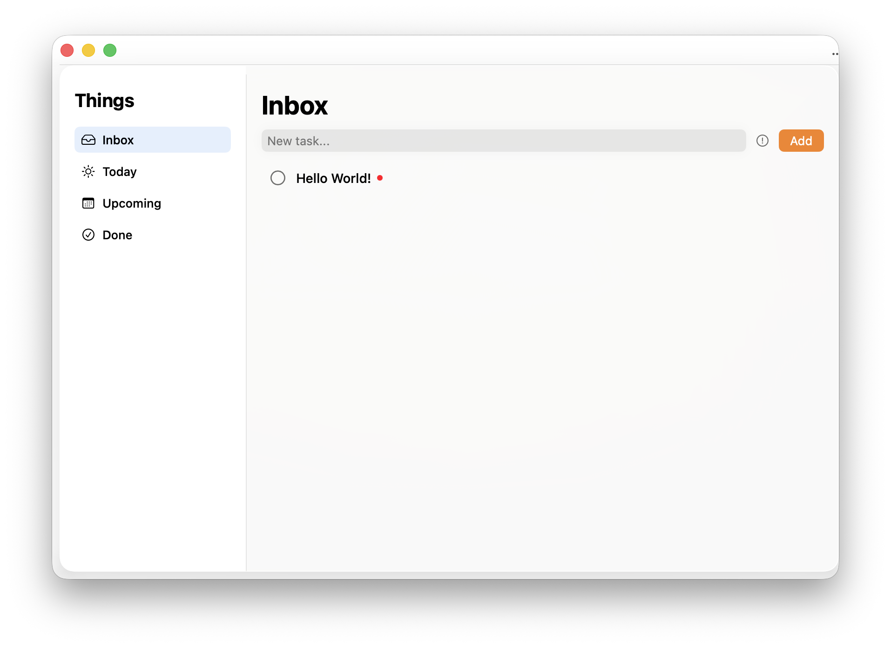
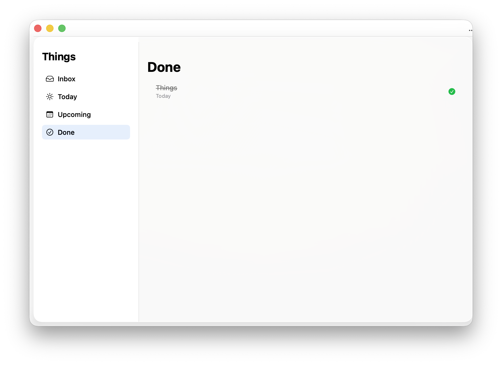
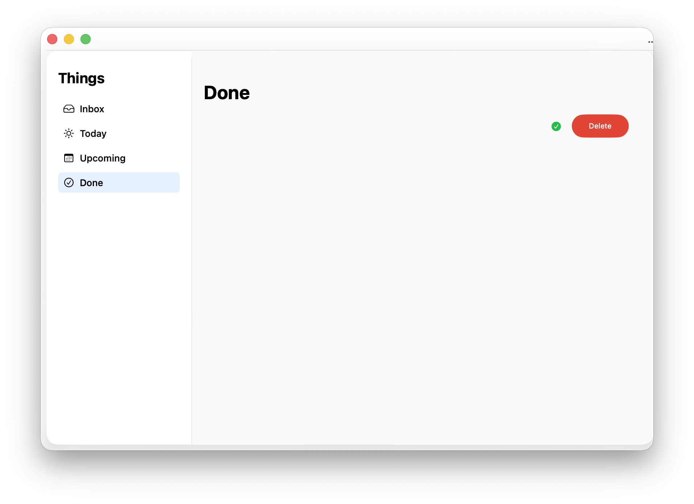

# Things-style Task Manager

A polished macOS productivity app inspired by the workflow of Things 3.

---

## Features

- Capture tasks into Inbox, Today, Upcoming, Anytime, Someday, and Logbook
- Add notes, dates, and importance directly from the quick-entry composer
- Automatic Today and Upcoming views based on scheduled dates
- Complete, restore, move, delete, and mark tasks from each row menu
- Sidebar counts, empty states, grouped upcoming/logbook sections, and hover actions
- Persistent storage using UserDefaults + Codable with backward-compatible decoding
- Clean SwiftUI architecture with reusable views

---

## UI / UX Focus

This project focuses on:
- calm macOS-native task management
- fast capture and low-friction triage
- readable lists with just enough metadata
- smooth state transitions
- Things-like task flow without copying proprietary assets

---

## Tech Stack

- Swift
- SwiftUI
- Combine
- UserDefaults (persistence)

---

## What I learned

- State management in SwiftUI
- Building custom UI components
- Handling animations with state changes
- Persisting structured data locally
- Designing task-based UI flows

---

## Screenshots

---

## Future improvements

- Drag & drop reordering
- Inline editing
- Better task scheduling system
- iCloud sync
- Advanced filtering system
